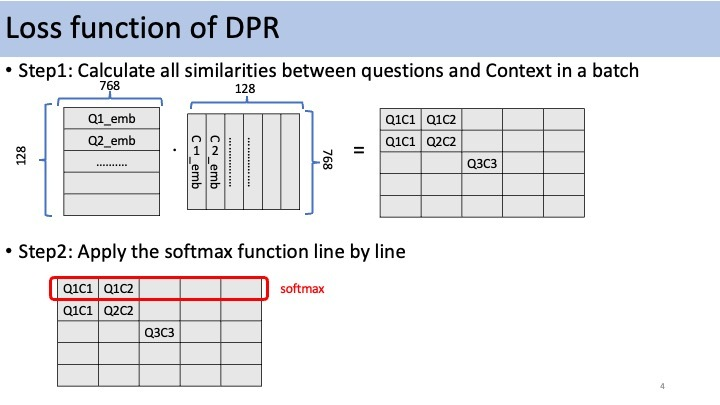
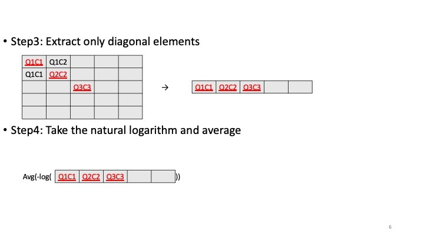

# DPR_finetune_knowitvqa
Knowledge-Based Video Question AnsweringタスクのデータセットであるknowitVQAデータセットの解答根拠(reason)から適切なものを検索するために、Open Domain Question Answeringタスク用の[Dense Passage Retrievalモデル](https://huggingface.co/docs/transformers/model_doc/dpr)をfinetuningする。

## 設定
1. リポジトリクローン: 
    
    `git clone 'https://github.com/kuroda0817/DPR_finetune_knowitvqa.git`
    
2. [KnowitVQAデータセット](https://knowit-vqa.github.io/)をダウンロードして`knowit_data/`直下に置く。

3. 環境構築:
    - Python 3.9
    - numpy (`pip install numpy`)
    - pandas (`pip install pandas`)
    - pytorch 1.13.1 (`pip3 install torch torchvision torchaudio`)
    - transformers 4.26.1 (`pip install transformers`) 
## 保存先
デフォルトでは./data_answer_testが作成され./data_answer_test/model/に10エポックごとのQuestionとContextのencoderモデルがそれぞれ保存される。

## 実行
```
python DPR_finetune_knowitvqa.py
```
## ロス関数


